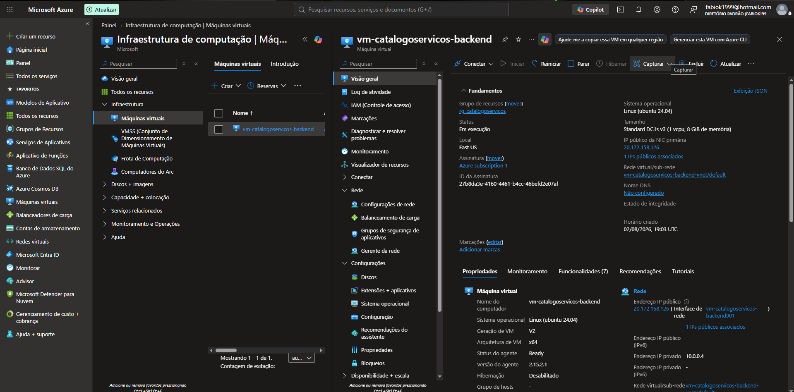
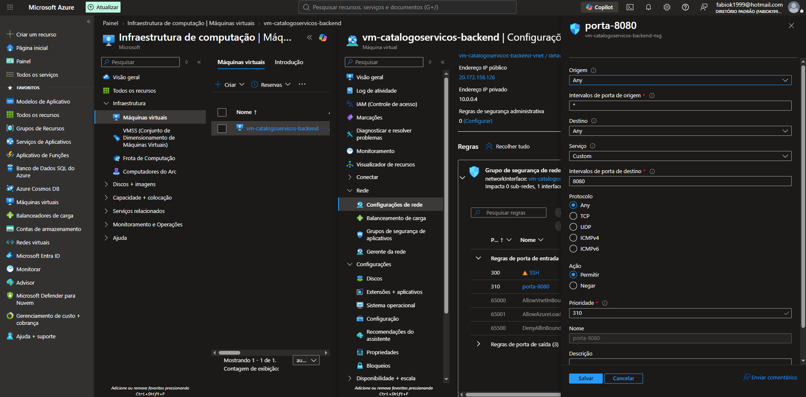
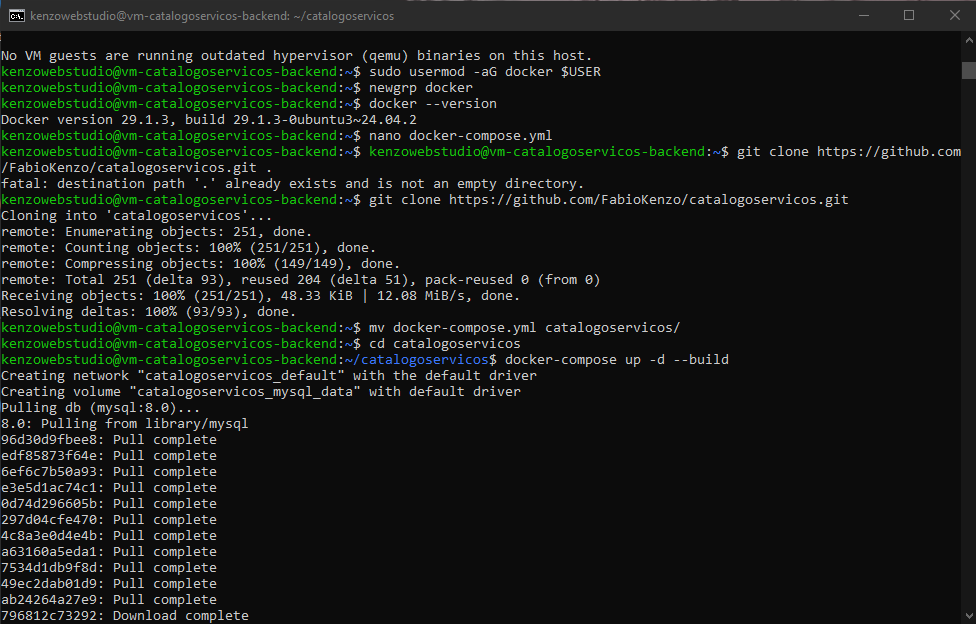

# CatálogoServiços - Backend API 🚀

API REST desenvolvida em **Java 21** e **Spring Boot** para o **CatálogoServiços**, uma plataforma web que conecta clientes a prestadores de serviços locais de forma simples, rápida e gratuita.

O projeto foi desenvolvido como parte de uma atividade de **Extensão Universitária da UNITAU**, com o objetivo de facilitar a divulgação de profissionais autônomos e ajudar moradores a encontrarem serviços em sua região.

---

## 🌐 Aplicação Online

### Frontend

https://catalogoservicos-frontend.netlify.app/

### Backend

API REST hospedada na plataforma Render.

---

## 🎯 Problema Resolvido

Muitos profissionais autônomos dependem exclusivamente de indicações para conseguir novos clientes, enquanto moradores frequentemente têm dificuldade em encontrar prestadores confiáveis para necessidades do dia a dia.

O CatálogoServiços foi criado para aproximar esses dois públicos através de uma plataforma simples, acessível e gratuita.

---

## 🚀 Como Funciona

### 👤 Para Clientes

* Criar uma conta gratuitamente.
* Pesquisar prestadores por categoria.
* Filtrar resultados por bairro.
* Visualizar informações dos profissionais.
* Entrar em contato diretamente pelo WhatsApp.

### 🛠️ Para Prestadores

* Criar uma conta na plataforma.
* Cadastrar seu perfil profissional.
* Informar categoria de atuação.
* Definir bairro de atendimento.
* Adicionar descrição dos serviços.
* Receber contatos diretamente dos clientes.

---

## 📸 Funcionalidades Principais

* Cadastro de usuários.
* Cadastro de prestadores de serviço.
* Busca por categoria.
* Busca por bairro.
* Filtros combinados (categoria + bairro).
* Integração direta com WhatsApp.
* Persistência de dados em MySQL.
* Comunicação Frontend ↔ Backend através de API REST.
* Configuração de CORS para integração segura com o frontend.

### 🔧 Diferenciais Técnicos

* Tratamento de inconsistências de entrada provenientes de teclados mobile (iOS e Android) através da sanitização de strings utilizando `.trim()`.
* Consultas dinâmicas utilizando Spring Data JPA para busca por categoria, bairro ou ambos simultaneamente.
* Uso de variáveis de ambiente para proteção das credenciais do banco de dados.
* Deploy completo em ambiente de produção utilizando serviços gratuitos em nuvem.

---

## 🛠️ Tecnologias Utilizadas

### Backend

* Java 21 (LTS)
* Spring Boot 3
* Spring Data JPA
* Hibernate
* Maven

### Banco de Dados

* MySQL

### Infraestrutura

* Docker
* Render
* Aiven

---

# ☁️ Deploy, Infraestrutura e Testes na Microsoft Azure

Como parte do meu aprendizado em **Cloud Computing**, **DevOps** e preparação para a certificação **Microsoft Azure AZ-900**, esta API também passou por um processo completo de **provisionamento, implantação, validação e testes** na Microsoft Azure, permitindo colocar em prática a hospedagem de aplicações **Java/Spring Boot** em infraestrutura de nuvem.

Durante esse processo foram realizados testes de publicação da aplicação em uma Máquina Virtual Linux, configuração de segurança da infraestrutura, execução da API utilizando Docker e validação da comunicação entre o backend e o frontend.

## 🏗️ Infraestrutura Utilizada

- Microsoft Azure Virtual Machine (Ubuntu Linux)
- Docker
- Azure Network Security Group (NSG)
- Azure Resource Group
- GitHub
- Java 21
- Spring Boot

---

## 🚀 Evidências da Implantação na Nuvem

Durante a implantação da aplicação foram validadas todas as etapas necessárias para disponibilizar a API em ambiente cloud.

### 1️⃣ Provisionamento da Máquina Virtual

Criação e configuração de uma **Máquina Virtual Linux (Ubuntu)** na Microsoft Azure, incluindo acesso remoto via SSH, configuração do endereço IP público e preparação do ambiente para execução da aplicação.





*Máquina Virtual provisionada na Microsoft Azure para hospedagem da API.*

---

### 2️⃣ Configuração da Infraestrutura e Segurança

Configuração das regras de segurança utilizando o **Azure Network Security Group (NSG)**, permitindo o acesso às portas utilizadas pela aplicação e garantindo uma comunicação segura entre cliente e servidor.





*Configuração das regras de segurança da infraestrutura na Microsoft Azure.*

---

### 3️⃣ Deploy da API utilizando Docker

Execução da aplicação **Spring Boot** em um container Docker dentro da Máquina Virtual Linux, validando o funcionamento da API em ambiente cloud.





*Aplicação Spring Boot executando em container Docker na Microsoft Azure.*

---

## 🎯 Competências Demonstradas

Durante este processo foram aplicados conhecimentos em:

- Microsoft Azure
- Cloud Computing
- Infraestrutura como Serviço (IaaS)
- Provisionamento de Máquinas Virtuais Linux (Ubuntu)
- Configuração de acesso remoto via SSH
- Azure Resource Groups
- Azure Network Security Groups (NSG)
- Docker
- Deploy de aplicações Java/Spring Boot
- Redes e segurança em ambiente cloud
- Integração entre Frontend e Backend
- Testes de APIs com Postman
- DevOps Fundamentals

---

## 🏗️ Arquitetura da Aplicação

```text
Frontend (Angular + Bootstrap)
            │
            ▼
      API REST Spring Boot
            │
            ▼
        MySQL (Aiven)
```

---

## 📌 Endpoints Principais

### Usuários

```http
POST /api/usuarios
```

Criação de contas de usuários.

### Prestadores

```http
POST /api/prestadores
```

Cadastro de perfil profissional vinculado a um usuário.

### Busca de Serviços

```http
GET /api/servicos/buscar
```

Permite consultas utilizando:

* Categoria
* Bairro
* Categoria + Bairro

---

## 🗄️ Modelagem de Dados

### Usuário (`Usuario`)

Entidade responsável pela autenticação e identificação dos usuários da plataforma.

Principais atributos:

* Nome
* E-mail
* Senha

### Prestador (`Prestador`)

Entidade vinculada a um usuário através de relacionamento `@OneToOne`, contendo as informações profissionais do anunciante.

Principais atributos:

* Categoria
* Bairro
* Telefone (WhatsApp)
* Descrição do serviço

---

## 🌐 Deploy & Infraestrutura

A aplicação encontra-se publicada em ambiente de produção utilizando serviços gratuitos em nuvem.

### Backend

* Render
* Deploy automatizado via GitHub

### Banco de Dados

* Aiven MySQL

### Segurança

As credenciais de produção não ficam armazenadas no código-fonte e são gerenciadas através de variáveis de ambiente.

---

## 🚀 Executando Localmente

### Pré-requisitos

* Java 21
* Maven
* MySQL Server ou Docker

### 1. Clone o Repositório

```bash
git clone https://github.com/seu-usuario/catalogoservicos.git

cd catalogoservicos
```

### 2. Configure as Variáveis de Ambiente

O projeto utiliza variáveis de ambiente para armazenar as credenciais do banco de dados.

Exemplo:

```properties
SPRING_DATASOURCE_URL=jdbc:mysql://localhost:3306/seu_banco
SPRING_DATASOURCE_USERNAME=seu_usuario
SPRING_DATASOURCE_PASSWORD=sua_senha
```

O arquivo `application.properties` já está configurado para utilizar essas variáveis:

```properties
spring.datasource.url=${SPRING_DATASOURCE_URL}
spring.datasource.username=${SPRING_DATASOURCE_USERNAME}
spring.datasource.password=${SPRING_DATASOURCE_PASSWORD}

spring.jpa.database-platform=org.hibernate.dialect.MySQLDialect

spring.jpa.hibernate.ddl-auto=update
spring.jpa.show-sql=true
spring.jpa.properties.hibernate.format_sql=true
```

### 3. Execute a Aplicação

```bash
mvn spring-boot:run
```

### 4. Acesse a API

```text
http://localhost:8080
```

---

## 🎓 Projeto de Extensão Universitária

Este projeto foi desenvolvido como parte das atividades de Extensão Universitária do curso de **Análise e Desenvolvimento de Sistemas (ADS)** da **UNITAU**, aplicando conceitos de desenvolvimento Full Stack, banco de dados, APIs REST e computação em nuvem para solucionar uma necessidade real da comunidade.

---

## 👨‍💻 Desenvolvedor

**Fábio Kenzo Okamura**

🎓 Estudante de Análise e Desenvolvimento de Sistemas (ADS) - UNITAU

